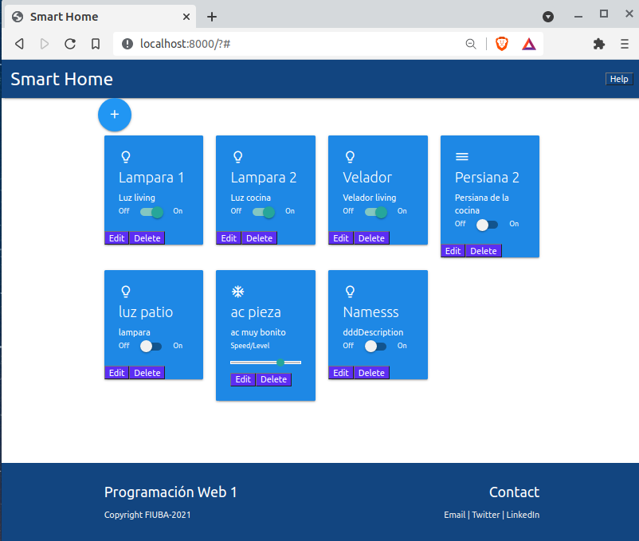
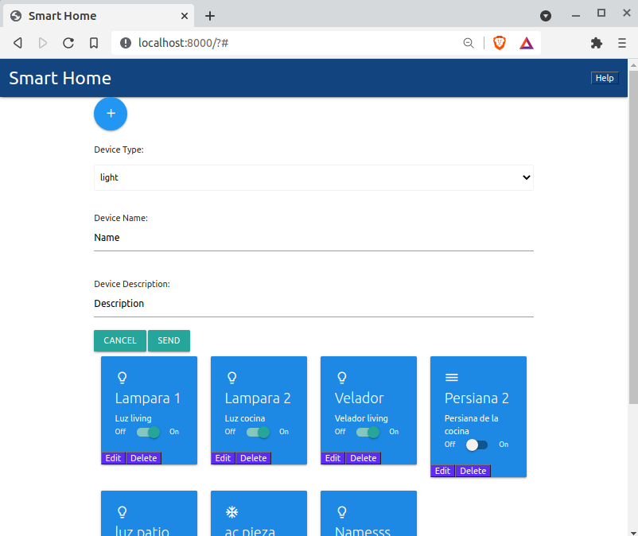
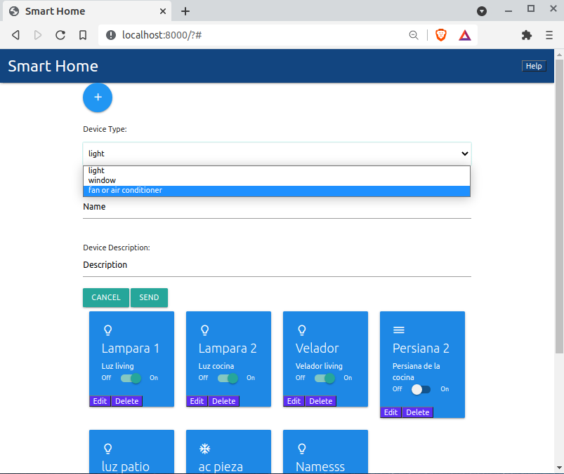
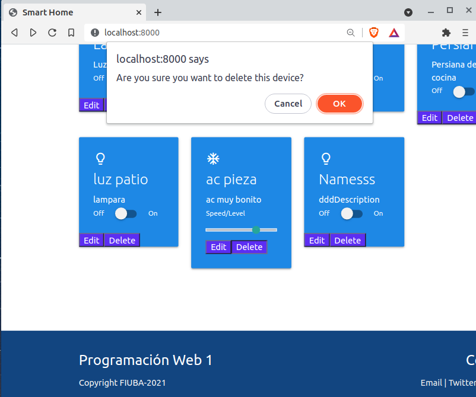
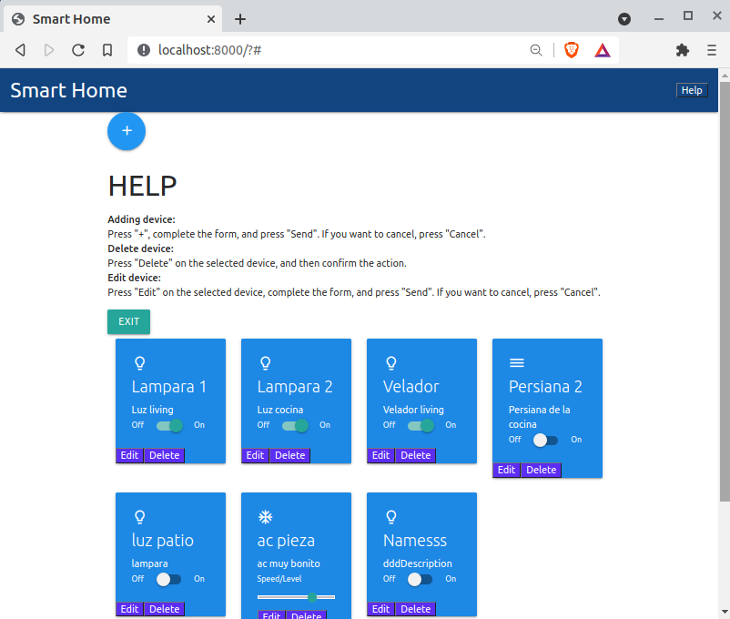

<a href="https://www.gotoiot.com/">
    
</a>

Web App Full Stack Base
=======================

*Ayudaría mucho si apoyaras este proyecto con una ⭐ en Github!*

Este proyecto es una aplicación web fullstack que se ejecuta sobre el ecosistema `Docker`. Está compuesta por un compilador de `TypeScript` que te permite utilizar este superset de JavaScript para poder programar un `cliente web`. También tiene un servicio en `NodeJS` que te permite ejecutar código en backend y al mismo tiempo disponibilizar el código del cliente web para interactar con el servicio. Además tiene una `base de datos` MySQL que puede interactuar con el backend para guardar y consultar datos, y de manera adicional trae un `administrador` de base de datos para poder administrar la base en caso que lo necesites.

La aplicación IoT de base que viene con este proyecto se encarga de crear una tabla llamada `Devices` en la base de datos, y la idea es que vos puedas desarrollar el código de backend y frontend que te permita controlar desde el navegador el estado de los devices de un hogar inteligente - *como pueden ser luces, TVs, ventiladores, persianas, enchufes y otros* - y almacenar los estados de cada uno en la base de datos. 

Realizando estas tareas vas a a tener una aplicación fullstack IoT del mundo real que utiliza tecnologías actuales en la que un backend es capaz de interactuar con una DB para cumplir con las peticiones de control que se le mandan desde el cliente web.

En esta imagen podés ver una posible implementación del cliente web que controla los artefactos del hogar.



## Comenzando 🚀

Esta sección es una guía con los pasos escenciales para que puedas poner en marcha la aplicación.

<details><summary><b>Mira los pasos necesarios</b></summary><br>

### Instalar las dependencias

Para correr este proyecto es necesario que instales `Docker` y `Docker Compose`. 

En [este artículo](https://www.gotoiot.com/pages/articles/docker_installation_linux/) publicado en nuestra web están los detalles para instalar Docker y Docker Compose en una máquina Linux. Si querés instalar ambas herramientas en una Raspberry Pi podés seguir [este artículo](https://www.gotoiot.com/pages/articles/rpi_docker_installation) de nuestra web que te muestra todos los pasos necesarios.

En caso que quieras instalar las herramientas en otra plataforma o tengas algún incoveniente, podes leer la documentación oficial de [Docker](https://docs.docker.com/get-docker/) y también la de [Docker Compose](https://docs.docker.com/compose/install/).

Continua con la descarga del código cuando tengas las dependencias instaladas y funcionando.

### Descargar el código

Para descargar el código, lo más conveniente es que realices un `fork` de este proyecto a tu cuenta personal haciendo click en [este link](https://github.com/gotoiot/app-fullstack-base/fork). Una vez que ya tengas el fork a tu cuenta, descargalo con este comando (acordate de poner tu usuario en el link):

```
git clone https://github.com/USER/app-fullstack-base.git
```

> En caso que no tengas una cuenta en Github podes clonar directamente este repo.

### Ejecutar la aplicación

Para ejecutar la aplicación tenes que correr el comando `docker-compose up` desde la raíz del proyecto. Este comando va a descargar las imágenes de Docker de node, de typescript, de la base datos y del admin de la DB, y luego ponerlas en funcionamiento. 

Para acceder al cliente web ingresa a a la URL [http://localhost:8000/](http://localhost:8000/) y para acceder al admin de la DB accedé a [localhost:8001/](http://localhost:8001/). 

Si pudiste acceder al cliente web y al administrador significa que la aplicación se encuentra corriendo bien. 

> Si te aparece un error la primera vez que corres la app, deteńe el proceso y volvé a iniciarla. Esto es debido a que el backend espera que la DB esté creada al iniciar, y en la primera ejecución puede no alcanzar a crearse. A partir de la segunda vez el problema queda solucionado.

</details>

Continuá explorando el proyecto una vez que lo tengas funcionando.

## Configuraciones de funcionamiento 🔩

Al crearse la aplicación se ejecutan los contenedores de Docker de cada servicio, se crea la base de datos y sus tablas. A continuación podés encontrar info si querés cambiar la estructura de la DB o bien sus configuraciones de acceso.

<details><summary><b>Lee cómo configurar la aplicación</b></summary><br>

### Configuración de la DB

Como ya comprobaste, para acceder PHPMyAdmin tenés que ingresar en la URL [localhost:8001/](http://localhost:8001/). En el login del administrador, el usuario para acceder a la db es `root` y contraseña es la variable `MYSQL_ROOT_PASSWORD` del archivo `docker-compose.yml`.

Para el caso del servicio de NodeJS que se comunica con la DB fijate que en el archivo `src/backend/mysql-connector.js` están los datos de acceso para ingresar a la base.

Si quisieras cambiar la contraseña, puertos, hostname u otras configuraciones de la DB deberías primero modificar el servicio de la DB en el archivo `docker-compose.yml` y luego actualizar las configuraciones para acceder desde PHPMyAdmin y el servicio de NodeJS.

### Estructura de la DB

Al iniciar el servicio de la base de datos, si esta no está creada toma el archivo que se encuentra en `db/dumps/smart_home.sql` para crear la base de datos automáticamente.

En ese archivo está la configuración de la tabla `Devices` y otras configuraciones más. Si quisieras cambiar algunas configuraciones deberías modificar este archivo y crear nuevamente la base de datos para que se tomen en cuenta los cambios.

Tené en cuenta que la base de datos se crea con permisos de superusuario por lo que no podrías borrar el directorio con tu usuario de sistema, para eso debés hacerlo con permisos de administrador. En ese caso podés ejecutar el comando `sudo rm -r db/data` para borrar el directorio completo.

</details>


## Detalles principales 🔍

En esta sección vas a encontrar las características más relevantes del proyecto.

<details><summary><b>Mira los detalles más importantes de la aplicación</b></summary><br>
<br>

### Arquitectura de la aplicación

Como ya pudiste ver, la aplicación se ejecuta sobre el ecosistema Docker, y en esta imagen podés ver el diagrama de arquitectura.


### El cliente web

El cliente web es una Single Page Application que se comunica con el servicio en NodeJS mediante JSON a través de requests HTTP. Puede consultar el estado de dispositivos en la base de datos (por medio del servicio en NodeJS) y también cambiar el estado de los mismos. Los estilos del código están basados en **Material Design**.

### El servicio web

El servicio en **NodeJS** posee distintos endpoints para comunicarse con el cliente web mediante requests HTTP enviando **JSON** en cada transacción. Procesando estos requests es capaz de comunicarse con la base de datos para consultar y controlar el estado de los dispositivos, y devolverle una respuesta al cliente web también en formato JSON. Así mismo el servicio es capaz de servir el código del cliente web.

### La base de datos

La base de datos se comunica con el servicio de NodeJS y permite almacenar el estado de los dispositivos en la tabla **Devices**. Ejecuta un motor **MySQL versión 5.7** y permite que la comunicación con sus clientes pueda realizarse usando usuario y contraseña en texto plano. En versiones posteriores es necesario brindar claves de acceso, por este motivo la versión 5.7 es bastante utilizada para fases de desarrollo.

### El administrador de la DB

Para esta aplicación se usa **PHPMyAdmin**, que es un administrador de base de datos web muy utilizado y que podés utilizar en caso que quieras realizar operaciones con la base, como crear tablas, modificar columnas, hacer consultas y otras cosas más.

### El compilador de TypeScript

**TypeScript** es un lenguaje de programación libre y de código abierto desarrollado y mantenido por Microsoft. Es un superconjunto de JavaScript, que esencialmente añade tipos estáticos y objetos basados en clases. Para esta aplicación se usa un compilador de TypeScript basado en una imagen de [Harmish](https://hub.docker.com/r/harmish) en Dockerhub, y está configurado para monitorear en tiempo real los cambios que se realizan sobre el directorio **src/frontend/ts** y automáticamente generar código compilado a JavaScript en el directorio  **src/frontend/js**. Los mensajes del compilador aparecen automáticamente en la terminal al ejecutar el comando **docker-compose up**.

### Ejecución de servicios

Los servicios de la aplicación se ejecutan sobre **contenedores de Docker**, así se pueden desplegar de igual manera en diferentes plataformas. Los detalles sobre cómo funcionan los servicios los podés ver directamente en el archivo **docker-compose.yml**.

### Organización del proyecto

En la siguiente ilustración podés ver cómo está organizado el proyecto para que tengas en claro qué cosas hay en cada lugar.

```sh
├── db                          # directorio de la DB
│   ├── data                    # estructura y datos de la DB
│   └── dumps                   # directorio de estructuras de la DB
│       └── smart_home.sql      # estructura con la base de datos "smart_home"
├── doc                         # documentacion general del proyecto
└── src                         # directorio codigo fuente
│   ├── backend                 # directorio para el backend de la aplicacion
│   │   ├── index.js            # codigo principal del backend
│   │   ├── mysql-connector.js  # codigo de conexion a la base de datos
│   │   ├── package.json        # configuracion de proyecto NodeJS
│   │   └── package-lock.json   # configuracion de proyecto NodeJS
│   └── frontend                # directorio para el frontend de la aplicacion
│       ├── js                  # codigo javascript que se compila automáticamente
│       ├── static              # donde alojan archivos de estilos, imagenes, fuentes, etc.
│       ├── ts                  # donde se encuentra el codigo TypeScript a desarrollar
│       └── index.html          # archivo principal del cliente HTML
├── docker-compose.yml          # archivo donde se aloja la configuracion completa
├── README.md                   # este archivo
├── CHANGELOG.md                # archivo para guardar los cambios del proyecto
├── LICENSE.md                  # licencia del proyecto
```

<!-->> No olvides ir poniendo tus cambios en el archivo `CHANGELOG.md` a medida que avanzas en el proyecto.-->

</details>

## Detalles de implementación 💻

<!--En esta sección podés ver los detalles específicos de funcionamiento del código y que son los siguientes.-->

<details><summary><b>Mira los detalles de implementación</b></summary><br>

### Agregar un dispositivo


Presionando el botón "+" se despliega el formulario para incorporar un nuevo dispositivo.<br>


Se utiliza el selector para elegir el tipo de dispositivo.<br>


Una vez completados todos los datos se presiona "Send" y se graban los cambios en la base de datos..
Si se quiere cancelar se presiona "Cancel".

### Editar un dispositivo
Se presiona el botón "Edit" dentro del box del dispositivo.
De esta manera se lanza el formulario de agregar dispositivo con el nombre y la descripción del dispositivo precargado.
Una vez modificado se presiona "Send" y se graban los cambios en la base de datos.
Si se quiere cancelar se presiona "Cancel".

### Eliminar un dispositivo
Se presiona el botón "Delete" dentro del box del dispositivo. Aparece un mensaje de confirmación de eliminación y en caso de presionar "OK" se elimina el mismo de la base de datos y se refresca la pagina.<br>

### Ver pantalla de ayuda
Se presiona el botón "Help" dentro de la barra superior. Al presionar el botón "Exit" se retorna a la página web.<br>



### Frontend

El frontend posee solo un archivo html. La página se modifica dinámicamente según el accionar del usuario.

Archivo principal "/frontend/index.HTML":<br>
Contiene 2 partes, head y body.<br>
En el header se colocaron: <br>
*  la referencia a Materialize.
*  la referencia a los iconos de materialize.
*  la referecia al style.css local.
*  la escala de referencia para la característica responsive de la página.

Dentro del body se colocan los tres sectores: barra superior, cuerpo main y barra inferior.
<br>

En la barra superior, se encuentra el nombre de la página y un botón de ayuda.<br>
En la barra en la barra inferior, se encuentra el nombre del autor de la página y las formas poder contactar con el mismo.<br>
Dentro del cuerpo main, se aloja un botón "+" que permite ingresar dispositivos, un contenedor con id="deviceForm" que alojará formularios de edición y guia de ayuda, inicialmente vacio. Finalmente se presentan los bloques con los distintos dispositivos que posee la base de datos.<br> 
La composición de la cuadrícula de los dispositivos se realiza en forma dinámica al cargar la página.<br>
Al finalizar el cuerpo main se colocan los enlaces a los script JS que se utilizan en la página.<br>

<strong>Directorio "/frontend/ts":</strong><br>
Dentro de este directorio se encuentran todos los archivos typescript que permiten el funcionamiento dinámico de la página. Se describen a continuación:<br>
* devices.ts: archivo que contiene la clase device con todos los parámetros que poseen los dispositivos cargados en la base de datos y la funcion displayDevice, que devuelve un string con contenido html que genera para una de las tarjetas de los dispositivos y cuyo parámetro de entrada es una instancia de la clase Device. Esta función selecciona el logo del dispositivo según el tipo e incorpora los botones de "Edit" y "Delete".
* Formulary.ts: archivo que posee las 3 funciones que permiten la conformación, la generación y la destrucción del formulario para ingresar un nuevo dispositivo o editar uno ya creado.<br>
  <u>Función createForm</u>: función que devuelve un string con código HTMl para la conformación del formulario. El mismo posee un seleccionador para el tipo de dispositivo , 2 entradas de texto(para el nombre y la descripcion) y dos botones ("Send" y "Cancel"). El parámetro que se pasa es una instancia de la clase Device de la cual se obtienen los datos precargados.<br>
  <u>Función callForm</u>: función que recibe como parámetro una instancia de la clase main(que contiene la ventana principal). Esta función busca del DOM el objeto con id="deviceForm"(que se crea en index.html) y le asigna el valor devuelto por createForm (función que se llama con parámetro la instancia del objeto device que contiene la clase main). Luego de esto, asigna a los botones el listener de eventos.<br>
  <u>Función hideForm</u>: función que recibe como parámetro una instancia de la clase main, busca del dom el objeto con id="deviceForm" y lo vacía. Luego de esto, refresca la pagina.
  
* Help.ts : funciones similares a las que generan el formulario, y utiliza el mismo container de la página, solo que no se edita su interior y posee un solo botón de salida.<br>
 <u>Función createHelp</u>: genera el texto de ayuda,<br>
 <u>Función callHelp</u>: obtiene del DOM el objeto deviceForm, le asigna el texto generado con createHelp y asigna al botón de salida el listener de eventos<br>
 <u>Función hideHelp</u>: destruye el help.<br>

* framework.ts : archivo de define una clase que contiene las funciones Asincrónicas que se utilizan para comunicarse con el servidor.<br>
<u>public requestGET</u>: con parámetros URL del servidor y  clase listener que analizará las respuestas, solicita al servidor la lista de todos los dispositivos de la base de datos. La clase listerner que se pasa como referencia debe poseer implementada la interfase descripta en "GetResponseListener".<br>
<u>public requestDEL</u>: con parámetros URL del servidor, clase listener que analizará las respuestas y un string data con el id del dispositivo a borrar. Esta función solicita al servidor que elimine un dispositivo específico de la base de datos. La clase listerner que se pasa como referencia debe poseer implementada la interfase descripta en "DeleteResponseListener".<br>
<u>public requestPOST</u>: con parámetros URL del servidor, clase listener que analizará las respuestas y un string formato JSON con la estructura de un dispositivo, solicita al servidor que ingrese a la base de datos el dispositivo. En caso de ya existir un dispositivo con esa id, se actualizan sus datos. La clase listerner que se pasa como referencia debe poseer implementada la interfase descripta en "POSTResponseListener".<br>
<u>public requestPUT</u>: con parámetros URL del servidor, clase listener que analizará las respuestas y string con identificación del dispositivo, solicita al servidor que actualice en la base de datos el estado del dispositivo. La clase listerner que se pasa como referencia debe poseer implementada la interfase descripta en "PUTResponseListener".<br>

* main.ts : archivo de define una clase la clase principal de la página.<br>
  La clase main contiene los siguientes elementos:<br>
  nombre: string que posee el nombre la clase.
  statusForm: string que permite filtrar los eventos de los botones. Posee 4 posibilidades: "waiting","inForm","inEdit" y "inHelp".<br>
  deviceNumber: número de dispositivo, se utiliza para guardar la información del dispositivo actual.<br>
  localDevice: instancia de Device que guarda los datos del dispositivo que se quiere editar. <br>
  framework: instancia de la clase que contiene las funciones para comunicarse con el servidor. <br>

  El constructor de la clase main consulta mediante la función requestGet la lista de dispositivos que contiene la base de datos. Al  cargarse la página se llama a este constructor.<br>

  Función handleEvent: recibe como parámetro un evento. Filtra que solo sea un evento del tipo "click".<br>
  Luego de ello, dependiendo del texto que posea el botón y del statusForm en que se encuentre la clase Main, se llaman a distintas funciones. <br>

  Función deviceStateChangue: se llama cuando se activa o se desactiva un switch en un dispositivo o bien se cambia el valor con el slider. Se obtiene el dispositivo desde el DOM y se llama a la función requestPUT pasando como parámetro el dispositivo en formato JSON con el estado actualizado.<br>

  Función deleteDevice: se llama cuando se presiona el botón "Delete" y se confirma con "ok". Recibe como parámetro el id del dispositivo a eliminar y llama a la función requestDel con dicho id como parámetro.<br>


  Función editDevice: se llama cuando se presiona el botón "Edit" y el statusForm es "waiting". Recibe como parámetro el id del dispositivo a editar dentro de un string. Obtiene la información fragmentando el string.  Llama a la función getDevice con dicho id como parámetro, cargando en el componente localDevice los parámetros a editar. Luego de esto, pasa el statusForm a "inEdit" y retorna<br>

  Función sendDevice: se llama cuando se presiona el botón "Send" y el statusForm es "inEdit" o "inForm". Recibe como parámetro el id del dispositivo a enviar. Obtiene la información buscando los objetos del formulario desde el DOM. Genera el JSON con la información del dispositivo y llama a la función requestPost con dicho id como parámetro. Luego de ello retorna.<br>  

  Función getElement: tiene como parámetro un string con la id del elemento y retorna el objeto HTMLelement del DOM.<br>  

  Función getDevice: tiene como parámetro la id del elemento y utilizando la función getElement, carga en el componente localDevice de la clase Main todos los parámetros del dispositivo.<br>  

  La clase Main implementa todas las respuestas a las funciones de la clase framework. En el caso de GetResponseListener, genera toda la lista de dispositivos. Mientras que en las funciones PostResponseListener, DeleteResponseListener y PutResponseListener, en caso de haber algun error, se genera un mensaje de alerta en la ventana. Si no hubo error, solo imprime en la consola el mensaje del servidor.  


<br>


### Backend

<!--Completá todos los detalles de funcionamiento sobre el backend, sus interacciones con el cliente web, la base de datos, etc.-->

El backend fue desarrollado en NodeJs utilizando express JS. Posee cuatro endpoints que permiten al cliente interactuar con la base de datos.

<details><summary><b>Ver los endpoints disponibles</b></summary><br>

<!--Completá todos los endpoints del backend con los metodos disponibles, los headers y body que recibe, lo que devuelve, ejemplos, etc.-->

1) Devolver el estado de los dispositivos.

```json
{
    "method": "get",
    "request_headers": "application/json",
    "request_body": "",
    "response_code": 200,
    "request_body": {
        "devices": [
            {
                "id": 1, 
                "name": "Lampara 1", 
                "description": "Luz living", 
                "state": false, 
                "type": 1,
                
            }
        ]
    },
}
```
2) Eliminar dispositivo de la base de datos
```json
{
    "method": "delete",
    "request_headers": "application/json",
    "request_parameter": "",
    "request_body":{
                    "id:1"
                    },
    "response_code": 200,
    "response_body": {     
                "Item deleted"
    },
}
```
3) Agregar/editar dispositivo en base de datos
```json
{
    "method": "post",
    "request_headers": "application/json",
    "request_parameter": "",
    "request_body": 
                     {
                        "name":"example",
                        "type":"1",
                        "description":"this is an example device",
                        "id":"1"
                      }                      
                    ,
    "response_code": 200,
    "response_body": {     
                "Item add"
    },
}
```
4) Cambiar estado de dispositivo en base de datos
```json
{
    "method": "put",
    "request_headers": "application/json",
    "request_parameter": "",
    "request_body": 
                     {                       
                        "id":"1",
                        "status":" true",                      
                      }
                    ,
    "response_code": 200,
    "response_body": {     
                "Item status Updated"
    },
}
```
</details>

</details>


## Tecnologías utilizadas 🛠️

En esta sección podés ver las tecnologías más importantes utilizadas.

<details><summary><b>Mira la lista completa de tecnologías</b></summary><br>

* [Docker](https://www.docker.com/) - Ecosistema que permite la ejecución de contenedores de software.
* [Docker Compose](https://docs.docker.com/compose/) - Herramienta que permite administrar múltiples contenedores de Docker.
* [Node JS](https://nodejs.org/es/) - Motor de ejecución de código JavaScript en backend.
* [MySQL](https://www.mysql.com/) - Base de datos para consultar y almacenar datos.
* [PHPMyAdmin](https://www.phpmyadmin.net/) - Administrador web de base de datos.
* [Material Design](https://material.io/design) - Bibliotecas de estilo responsive para aplicaciones web.
* [TypeScript](https://www.typescriptlang.org/) - Superset de JavaScript tipado y con clases.

</details>

## Contribuir 🖇️

Si estás interesado en el proyecto y te gustaría sumar fuerzas para que siga creciendo y mejorando, podés abrir un hilo de discusión para charlar tus propuestas en [este link](https://github.com/gotoiot/app-fullstack-base/issues/new). Así mismo podés leer el archivo [Contribuir.md](https://github.com/gotoiot/gotoiot-doc/wiki/Contribuir) de nuestra Wiki donde están bien explicados los pasos para que puedas enviarnos pull requests.

## Sobre Goto IoT 📖

Goto IoT es una plataforma que publica material y proyectos de código abierto bien documentados junto a una comunidad libre que colabora y promueve el conocimiento sobre IoT entre sus miembros. Acá podés ver los links más importantes:

* **[Sitio web](https://www.gotoiot.com/):** Donde se publican los artículos y proyectos sobre IoT. 
* **[Github de Goto IoT:](https://github.com/gotoiot)** Donde están alojados los proyectos para descargar y utilizar. 
* **[Comunidad de Goto IoT:](https://groups.google.com/g/gotoiot)** Donde los miembros de la comunidad intercambian información e ideas, realizan consultas, solucionan problemas y comparten novedades.
* **[Twitter de Goto IoT:](https://twitter.com/gotoiot)** Donde se publican las novedades del sitio y temas relacionados con IoT.
* **[Wiki de Goto IoT:](https://github.com/gotoiot/doc/wiki)** Donde hay información de desarrollo complementaria para ampliar el contexto.

## Muestas de agradecimiento 🎁

Si te gustó este proyecto y quisieras apoyarlo, cualquiera de estas acciones estaría más que bien para nosotros:

* Apoyar este proyecto con una ⭐ en Github para llegar a más personas.
* Sumarte a [nuestra comunidad](https://groups.google.com/g/gotoiot) abierta y dejar un feedback sobre qué te pareció el proyecto.
* [Seguirnos en twitter](https://github.com/gotoiot/doc/wiki) y dejar algún comentario o like.
* Compartir este proyecto con otras personas.

## Autores 👥

Las colaboraciones principales fueron realizadas por:

* **[Agustin Bassi](https://github.com/agustinBassi)**: Ideación, puesta en marcha y mantenimiento del proyecto.
* **[Ernesto Giggliotti](https://github.com/ernesto-g)**: Creación inicial del frontend, elección de Material Design.
* **[Brian Ducca](https://github.com/brianducca)**: Ayuda para conectar el backend a la base de datos, puesta a punto de imagen de Docker.

También podés mirar todas las personas que han participado en la [lista completa de contribuyentes](https://github.com/###/contributors).

## Licencia 📄

Este proyecto está bajo Licencia ([MIT](https://choosealicense.com/licenses/mit/)). Podés ver el archivo [LICENSE.md](LICENSE.md) para más detalles sobre el uso de este material.

---

**Copyright © Goto IoT 2021** ⌨️ [**Website**](https://www.gotoiot.com) ⌨️ [**Group**](https://groups.google.com/g/gotoiot) ⌨️ [**Github**](https://www.github.com/gotoiot) ⌨️ [**Twitter**](https://www.twitter.com/gotoiot) ⌨️ [**Wiki**](https://github.com/gotoiot/doc/wiki)
